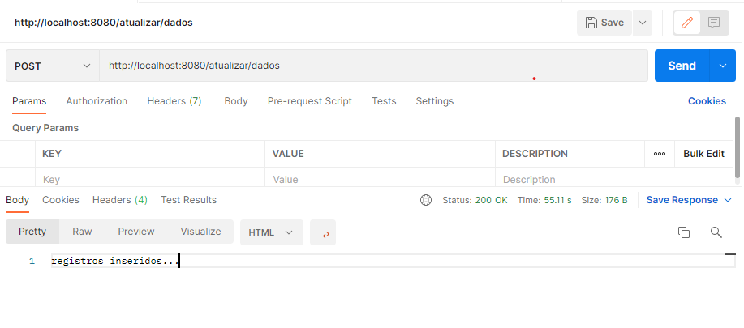
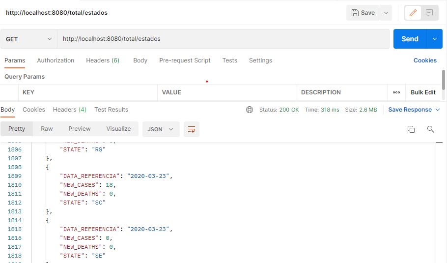
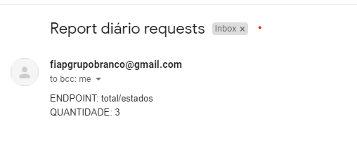

# RPA Project

### Objetivo do exercício:

Um funcionário do ministério da saúde, contratou sua empresa para realizar o desenvolvimento de uma API que se comunicará com o web site do governo e que será responsável por alimentar a plataforma com informações sobre a COVID-19.

O funcionário solicitou informações tais como (todos os dados devem ser de 2 anos atrás em relação a data em que foi realizada a requisição, por exemplo, se a requisição foi realizada dia 30/03/2022, devem ser analisados dados de 30/03/2020):
<br /> <br />

- Média móvel dos 7 dias anteriores (nível Brasil);
- Média móvel dos 7 dias anteriores do estado escolhido;
- Gráfico de barras com o número de casos do dia por estados;
- Gráfico de linha com uma série temporal de casos, por estado, em que será recebido data de inicio data de fim;
- Além disso, o funcionário pediu que enviasse a ele, uma vez por dia, um email dizendo quanto cada requisição foi utilizada ao longo daquele dia.

<br/><br/>


## Solução geral

Tendo em vista o problema do funcionário, pensamos em criar uma estrutura na qual buscasse os dados na web mais atualizados (sugestão de utilizar a mesma base do Google) e disponibilizar uma API para consumir esses dados. Após isso, construir a estrutura na Cloud, para que assim possamos apresentar as informações e gráficos no Power Bi em tempo real.

### Link aplicação -> [Power Bi](https://app.powerbi.com/view?r=eyJrIjoiNDUwMzRhNGMtOTRlMi00YjE1LWE0YTctYmU4MzhmNjUzYzI2IiwidCI6IjExZGJiZmUyLTg5YjgtNDU0OS1iZTEwLWNlYzM2NGU1OTU1MSIsImMiOjR9)

### Fonte dos dados -> [GitHub](https://raw.githubusercontent.com/wcota/covid19br/master/cases-brazil-states.csv)


*Observação: caso queira testar a aplicação, utilize a branch mysql. Com ela, você pode seguir os passos abaixo para levatar toda estrutura necessária rodando a aplicação local. Na branch master, contém os arquivos utilizados para Cloud com terraform, que é requerido algumas credenciais.* 


<br/><br/>

# App

## Iniciar estrutura com Docker
``` docker-compose up```

<br/><br />

## MYSQL | Estrutura Tabelas

TABELA: HISTORICO_COVID_POR_ESTADOS
 - DATA_REFERENCIA 
 - STATE
 - DEATHS 
 - TOTAL_CASES 
 - NEW_DEATHS 
 - NEW_CASES 


 TABELA: TOTAL_REQUESTS
 - DATA_REFERENCIA 
 - QUANTIDADE
 - ENDPOINT

<br /> <br />

## APLICAÇÃO PRINCIPAL

Dentro do folder ``` ./app ``` encontramos esta estrutura:

- ``` /objects ``` 
    - ``` __init__.py ``` 
    - ``` DatabaseUtils.py ```
- ``` database.sql ```
- ``` Dockerfile ```
- ``` requirments.txt ```
- ``` script.py ```


1. No folder objects, contém o construtor e a classe database. Esta classe, que se encontra dentro do arquivo ``` DatabaseUtils.py ``` é responsável por organizar todos 
os comandos em SQL que vamos utilizar. Ou seja:

    - ``` execute_from_query() ```-> função responsável por executar os comandos iniciais de criação de tabelas dentro do arquivo database.sql;
    - ``` ingest() ```-> função responsável por inserir os registros da web no MYSQL;
    - ``` add_requests() ```-> função na qual monitora os acessos dos endpoints, caso tenha um acesso no endpoint em específico, existe a tabela TOTAL_REQUESTS para armazenar o endpoint e incrementar um acesso;
    - ``` get_requests() ```-> função que busca todos os requests de um endpoint em específico para incluir o valor total no corpo do email;
    - ``` get_total_estados() ``` -> função que realiza a busca de todos os registros na tabela principal;
    - ``` truncate_table_estados() ``` -> neste caso, a função limpa todos os registros da tabela principal preparando para a inclusão dos registros atualizados.

<br /> 

2. Arquivo ``` database.sql ``` contém comandos SQL para a criação inicial das tabelas utilizadas;


3. Arquivo ``` Dockerfile ``` responsável por construir a estrutura de serviços necessários para o bom funcionamento da aplicação;

4. Arquivo ``` requirments.txt ``` realiza a instalação inicial dos pacotes principais;

5. Arquivo **principal** ``` script.py ``` responsável por buscar todos os dados da COVID na web, e incluir em nossos registros, além disso, nesse arquivo criamos toda estrutura da API e criação de endpoints.

<br /> <br />

## API FLASK

Ao final do arquivo ``` ./app/script.py ```, é possível encontrar os endpoints abaixo:

- ``` localhost:8080/atualizar/dados ``` -> Acessa os dados atualizados da base utilizada, e substitui em nossos registros do banco; 




- ``` localhost:8080/total/estados ```   -> Retorna todos os registros do banco por estado;




- ``` localhost:8080/requests ```        -> Retorna quantidade de acessos dos enpoints daquele dia em questão e faz o envio do email;




<br /> <br/>


## Perguntas finais:
<br/>

1. **Antes, para conseguir essas informações, o usuário deveria ligar para o telefone do ministério da saúde solicitando estas informações. Entre um atendente e outro, para conseguir essas 4 informações (uma pessoa de São Paulo), o usuário levava cerca de 2min. Em quanto tempo esse usuário conseguiria essas informações utilizando a plataforma de vocês (soma do valor da latência média dos endpoints)?**

    R.: Abrindo o Power Bi e consumindo da API, leva 5 segundos

<br />

2. **Por que você escolheu essa fonte de dados e não outra? Que critérios vocês utilizaram para esta escolha?**

    R.: Esta fonte de dados apresentava uma atualização com certa frequência, os dados estavam organizados e foi uma fonte confiável pois é a mesma utilizada no Google.

<br /> 

3. **Um usuário cego deseja obter as informações. Seria possível a construção de alguma opção de acessibilidade para esse tipo de usuário?**

    R.: A partir da nossa aplicação, seria possível desenvolver uma maneira de apresentação de áudio para tornar acessível nosso projeto. Através de algumas pesquisas, notamos que o Power Bi não tem por padrão alguma ferramenta que contribua.

<br />

4. **Um usuário que deseja assinar a "newsletter" do site, conseguiria receber estas informações diariamente em seu email?**

    R.: Conseguiria sim, através do nosso script o usuário receberia os dados atualizados sobre COVID 19  diariamente. (Wellington AU, acredito que aqui você vai usar o cloud watch do AWS, daí se quiser reformular a questão fique a vontade).

<br />

5. **Considerando que era investido cerca de 0,10 centavos (dinheiro público) para cada ligação, que eram recebidas cerca de 100.000 ligações por dia e que a pandemia começou 01/03/2020 e terminou a exatamente 2 anos depois (situação hipotética), quanto você cobraria pra implantar sua solução, considerando que vocês como empresa querem maximizar os lucros e ao mesmo tempo, tornar a proposta atrativa para o governo? Por que esse valor foi escolhido?**

    R.: Chegamos a conclusão de uma estimativa de R$ 200.000,00 pois o mesmo apresenta uma estrutura já robusta para se enquadrar em qualquer sistema, apenas consumindo a API e inluindo o frame do Power Bi
